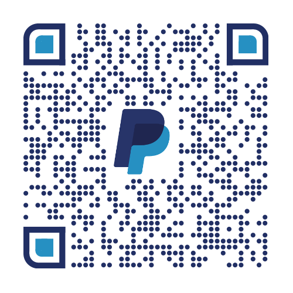

# 🌌 OmniNote AI
> **The High-Performance Neural Edge Engine for iOS.**
> Developed & Maintained by **BuzBest Inc.**


OmniNote AI is a zero-trust, local-first multimodal intelligence suite. It bridges the gap between high-level React Native UI and low-level C++ inference kernels, enabling **Llama 3.2 (GGUF)**, **Whisper**, and **Vision OCR** to run with near-zero latency on-device.

## 🧠 System Architecture
OmniNote utilizes a **Static-Linkage Microkernel** strategy:
- **Vision Layer:** Real-time character recognition via Apple Vision, mapping glyph coordinates to interactive UI tokens.
- **Inference Layer:** Metal-accelerated `llama.cpp` implementation utilizing **Deterministic Quantization (Q4_K_M)** for private reasoning.
- **Persistence Layer:** Zero-trust local encryption using the iOS Keychain and Secure Enclave.

## 🛠 Usage Protocol
### Prerequisites
- **Xcode 15.5+** | **Ruby 3.2+** | **Node 20+**
- Physical iOS Device (A15 Bionic or newer recommended for NPU acceleration).

### Cold Boot Setup
```bash
git clone https://github.com/YOUR_USERNAME/OmniNoteIOS
npm install
./setup_assets.sh  # Ingests model weights to FileSystem.documentDirectory
npx expo prebuild --platform ios
npx expo run:ios
```
# OmniNoteIOS: Private Clinical Intelligence Enclave
### *A Zero-Trust, Local-First AI Layer for Health Informatics*

[](#)
[](#)
[](#)

## 🏥 Executive Summary
**OmniNoteIOS** is a high-performance mobile intelligence environment designed for the secure processing of unstructured clinical narratives. Built as a core component of the **Trinity Engine** ecosystem, the application prioritizes **On-Device Inference** to eliminate "Data-in-Transit" risks, ensuring 100% **PHI/PII Sanitization** at the edge.

By leveraging quantized LLMs and medical-grade speech-to-text, OmniNoteIOS transforms raw clinician input into structured, interoperable data aligned with **SNOMED CT** and **HL7/FHIR** standards.

---

## 🛠 Tech Stack & Industry Lingo

### **Core Engineering**
* **React Native & Expo (SDK 50+):** Leveraged for cross-platform **Native Module** performance and rapid deployment.
* **TypeScript:** Strict typing for complex **Semantic Ontology** mapping and reliable state hydration.
* **Zustand:** High-performance, decoupled state management for **Latency-Critical** UI updates.

### **Intelligence & Edge Analytics**
* **Local LLM (llama.rn):** 4-bit/8-bit **Quantized GGUF** execution for real-time clinical reasoning without cloud dependency.
* **Whisper.rn:** Local-first medical transcription for offline clinical documentation and ambient listening.
* **D3.js & WebGL:** High-density **Multivariate Data Visualization** for longitudinal patient trends and **SDOH** (Social Determinants of Health) mapping.

### **Security & Infrastructure**
* **Biometric Enclave:** Hardware-level encryption integration via iOS Secure Enclave for secure session management.
* **QR-Sync Protocol:** A proprietary handshake for secure **Nitro Node** pairing and distributed AI task queuing.
* **AES-256 Field-Level Encryption:** Ensuring data-at-rest protection for all local SQL/NoSQL stores.

---

## 🧠 Applied Domain Expertise

| Industry Term | Application in OmniNoteIOS |
| :--- | :--- |
| **Edge Intelligence** | Migrating clinical NLP from centralized servers to mobile hardware to reduce attack surfaces. |
| **Semantic Interoperability** | Normalizing free-text notes into machine-readable **SNOMED CT** codes for downstream EHR integration. |
| **RAG (Retrieval-Augmented Generation)** | Building a localized vector store of patient history for context-aware AI clinical decision support. |
| **CI/CD & DevOps** | Automated deployment pipelines for **HIPAA-Technical Safeguards** and robust audit logging. |

---

## 🚀 Installation & Local Development

### Prerequisites
* Node.js (v18+)
* Xcode / Android Studio for **Native C++ Bridging**
* **Buz Studio** Local Node (Optional for distributed tasks)

### Setup
1. **Clone & Initialize:**
   ```bash
   git clone [https://github.com/rampedro/OmniNoteIOS.git](https://github.com/rampedro/OmniNoteIOS.git)
   cd OmniNoteIOS
   npm install


## 🤝 Contributing
We adhere to a **High-Density Code Standard**. Please review `CONTRIBUTING.md` before opening a Pull Request. We prioritize:
1. **Memory Safety:** No raw pointers in C++ bridge logic.
2. **Inference Speed:** Benchmark all changes against the Apple Neural Engine.
3. **UI Fluidity:** 60FPS target for high-density tokenized layouts.


---

<p align="center">
  
</p>

<p align="center">
  <sub>L &nbsp; E &nbsp; A &nbsp; R &nbsp; N &nbsp; &nbsp; & &nbsp; &nbsp; I &nbsp; N &nbsp; V &nbsp; E &nbsp; S &nbsp; T</sub>
  <br>
  <strong>──────────────────────────────</strong>
</p>

<p align="center">
  <em>Join the evolution of the <strong>Trinity Engine</strong>. Secure the future of Zero-Trust Clinical Intelligence.</em>
</p>


<p align="center">
 ⚖️ License
Licensed under **CC BY-NC 4.0**. 
**Commercial exploitation is strictly prohibited** without a private license from BuzBest Inc..
</p>

---
